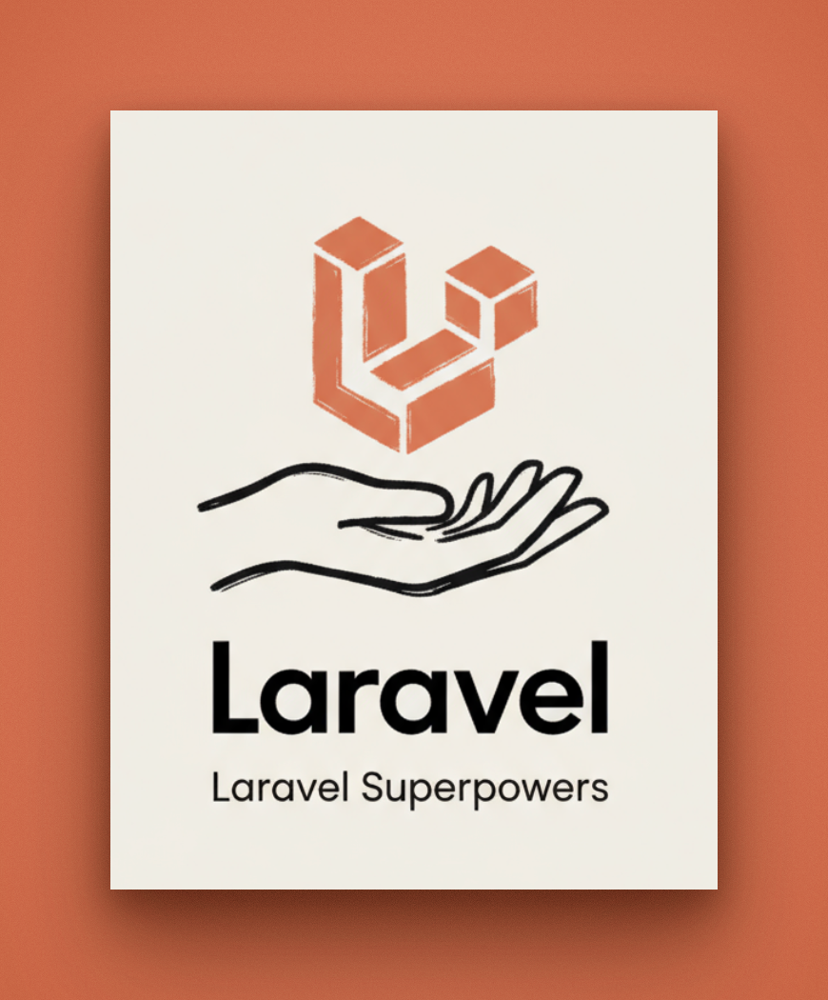
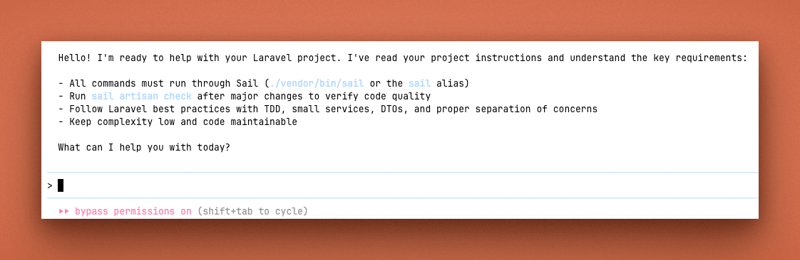
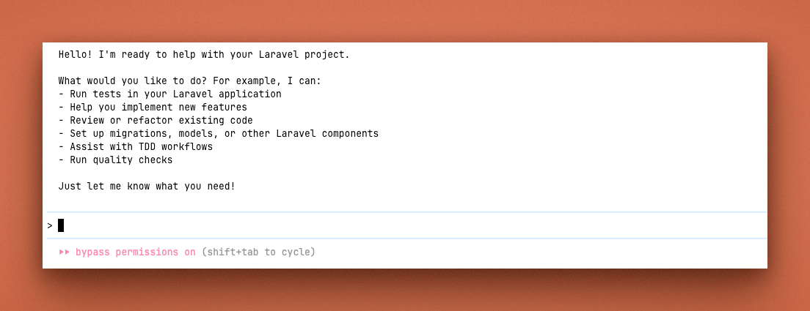

# Laravel Superpowers

<p align="center">
  
</p>

Laravel-focused skills for Claude Code and AI coding assistants. Brings proven workflows (TDD, debugging, planning) plus Laravel‑specific guidance that works with or without Sail.

## What You Get

<p align="center">
   
</p>

- **Laravel Skills** – Runner selection (Sail/non‑Sail), TDD with Pest/PHPUnit, migrations + factories, queues + Horizon, quality gates (Pint/Insights/PHPStan), pragmatic architecture (Ports & Adapters, Template Method), and complexity guardrails.
- Can be used on its own; also compatible with the base Superpowers plugin. Overlapping generic skills are removed here to avoid conflicts.

Plus:
- **Slash Commands** - `/superpowers-laravel:brainstorm`, `/superpowers-laravel:write-plan`, `/superpowers-laravel:execute-plan`
- **Automatic Integration** - Skills activate automatically when relevant
- **Consistent Workflows** - Systematic approaches to common engineering tasks

## SessionStart Preview

Below shows the startup message rendered when this plugin detects Laravel apps. The assistant now supports monorepos and adapts guidance based on which app is active and whether Sail is available.

### When Sail is detected - use Sail wrappers

<p align="center">
  
</p>

### When Sail is NOT detected - use host machine commands

<p align="center">
  
</p>

## Learn More

Read the introduction to the original Superpowers: [Superpowers for Claude Code](https://blog.fsck.com/2025/10/09/superpowers/)

## Installation

### Claude Code (via Plugin Marketplace)

```bash
# In Claude Code
/plugin marketplace add jpcaparas/superpowers-laravel
/plugin install superpowers-laravel@superpowers-laravel-marketplace
```

### Verify Installation

```bash
# Check that commands appear
/help

# Should see Laravel commands, e.g.:
# /superpowers-laravel:brainstorm
# /superpowers-laravel:write-plan
# /superpowers-laravel:execute-plan
# /superpowers-laravel:laravel-check
# /superpowers-laravel:laravel-tdd
```

### Codex (Experimental)

Codex support is experimental. Use the skills from this repo directly or copy the `skills/` subfolders you want into your project’s `.claude/skills`.

## Quick Start

### Using Slash Commands

**Brainstorm a design (Laravel-specific):**
```
/superpowers-laravel:brainstorm
```

**Create an implementation plan (Laravel-specific):**
```
/superpowers-laravel:write-plan
```

**Execute the plan (Laravel-specific):**
```
/superpowers-laravel:execute-plan
```

### Automatic Skill Activation

Skills activate automatically when relevant. For example:
- `test-driven-development` activates when implementing features
- `systematic-debugging` activates when debugging issues
- `verification-before-completion` activates before claiming work is done

### Runner Guidance (Sail vs host)

- Prefer running commands with Sail when it is available (`vendor/bin/sail` or a top‑level `./sail` helper); fall back to host tools otherwise.
- When Sail is declared but containers are not running, the assistant will ask whether to start Sail (`sail up -d`) or proceed with host tools. It will not run host `php`/`composer`/DB/Node commands until you choose.
- When Sail containers are running, use `sail` for all PHP/Composer/Node/DB commands to avoid environment drift; do not mix host and container installs in the same session.
- Portable alias:

```
alias sail='sh $([ -f sail ] && echo sail || echo vendor/bin/sail)'
```

### Monorepos and Multiple Apps

When multiple Laravel apps exist (for example `apps/api`, `apps/admin`), the SessionStart hook:

- Scans the repository recursively (ignores `vendor/`, `node_modules/`, `storage/`, and VCS/IDE folders) to find every `artisan` entrypoint.
- Detects Laravel version per app (prefers `composer.lock` via `jq`, falls back to `composer.json` constraint or a portable parser).
- Shows a summary list of all detected apps with version and Sail availability; marks the app in your current working directory as the “active” app.
- Emits Sail guidance and interactive safety ONLY for the active app.

Tip: `cd` into the app you intend to work on before starting your session to make it the active app.

## What's Inside

### Skills Library

Skills live in `skills/` and are designed for everyday Laravel work. Core examples include `runner-selection`, `tdd-with-pest`, `migrations-and-factories`, `quality-checks`, `queues-and-horizon`, and `ports-and-adapters` — with many more patterns ready for larger teams.

This fork focuses on Laravel skills and removes overlapping generic skills so it can be used independently without conflicts. It is also compatible with the base Superpowers plugin if you choose to install both. Use the Laravel‑specific commands here, or continue using the base plugin’s generic workflows.

#### Docs Intersection (Laravel 11.x + 12.x)

We added a focused set of skills that reflect patterns stable across both 11.x and 12.x:

- Form Requests & Validation (`laravel:form-requests`)
- Policies & Authorization (`laravel:policies-and-authorization`)
- Eloquent Relationships & Loading (`laravel:eloquent-relationships`)
- Transactions & Consistency (`laravel:transactions-and-consistency`)
- HTTP Client Resilience (`laravel:http-client-resilience`)
- Task Scheduling (`laravel:task-scheduling`)
- API Resources & Pagination (`laravel:api-resources-and-pagination`)
- Blade Components & Layouts (`laravel:blade-components-and-layouts`)
- Filesystem Uploads & URLs (`laravel:filesystem-uploads`)
- Rate Limiting & Throttle (`laravel:rate-limiting`)
- Exception Handling & Logging (`laravel:exception-handling-and-logging`)


### Commands

Commands are thin wrappers that activate skills. Key examples:

- `brainstorm.md` → `laravel:brainstorming`
- `write-plan.md` → `laravel:writing-plans`
- `execute-plan.md` → `laravel:executing-plans`
- `laravel-check.md` → `laravel:quality-checks`
- `laravel-tdd.md` → `laravel:tdd-with-pest`

Additional wrappers for the new docs‑intersection skills:

- `laravel-form-requests.md` → `laravel:form-requests`
- `laravel-policies.md` → `laravel:policies-and-authorization`
- `laravel-eloquent-relationships.md` → `laravel:eloquent-relationships`
- `laravel-transactions.md` → `laravel:transactions-and-consistency`
- `laravel-http-client.md` → `laravel:http-client-resilience`
- `laravel-scheduling.md` → `laravel:task-scheduling`
- `laravel-api-resources.md` → `laravel:api-resources-and-pagination`
- `laravel-blade-components.md` → `laravel:blade-components-and-layouts`
- `laravel-filesystem-uploads.md` → `laravel:filesystem-uploads`
- `laravel-rate-limiting.md` → `laravel:rate-limiting`
- `laravel-exceptions-logging.md` → `laravel:exception-handling-and-logging`

### Skills Overview

- Onboarding & Runner
- Planning & Execution
- Data & Schema
- Quality & Ops
- Architecture
- Performance
- Testing
- Utilities

## How It Works

1. **SessionStart Hook** – Adds Laravel onboarding (`laravel:using-laravel-superpowers`) when a Laravel repo is detected
2. **Skills System** - Uses Claude Code's first-party skills system
3. **Automatic Discovery** - Claude finds and uses relevant skills for your task
4. **Mandatory Workflows** - When a skill exists for your task, using it becomes required

## Philosophy

- **Test-Driven Development** - Write tests first, always
- **Systematic over ad-hoc** - Process over guessing
- **Complexity reduction** - Simplicity as primary goal
- **Evidence over claims** - Verify before declaring success
- **Domain over implementation** - Work at problem level, not solution level

## Contributing

Skills live directly in this repository. To contribute:

1. Fork the repository
2. Create a branch for your skill
3. Follow existing skill patterns (frontmatter name/description and focused, testable guidance)
4. Submit a PR with a short release-notes entry

### Run checks locally

Validate structure and conventions before pushing:

```
# Requires Node.js 18+ (20 recommended)
npx tsx scripts/validate_skills.ts
```

This verifies that:
- `skills/` contains only one-level directories, each with `SKILL.md`
- `SKILL.md` files have frontmatter with `name` (starting with `laravel:`) and `description`
- `.claude-plugin/plugin.json` has required fields
- `commands/*.md` have frontmatter `description`

## Updating

Update via the plugin menu or pull the latest changes if you cloned this repo.

## Related Tools

- Laravel Boost: a Laravel‑focused MCP server that augments AI‑powered local development (Cursor, Claude Code, etc.). See https://github.com/laravel/boost and https://boost.laravel.com/. This skill catalogue is designed to complement Boost if you install both.

## License

MIT License - see LICENSE file for details

## Support

- **Issues**: https://github.com/jpcaparas/superpowers-laravel/issues
- **Marketplace**: https://github.com/jpcaparas/superpowers-laravel
